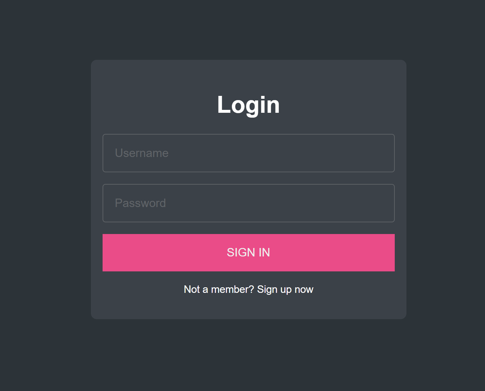
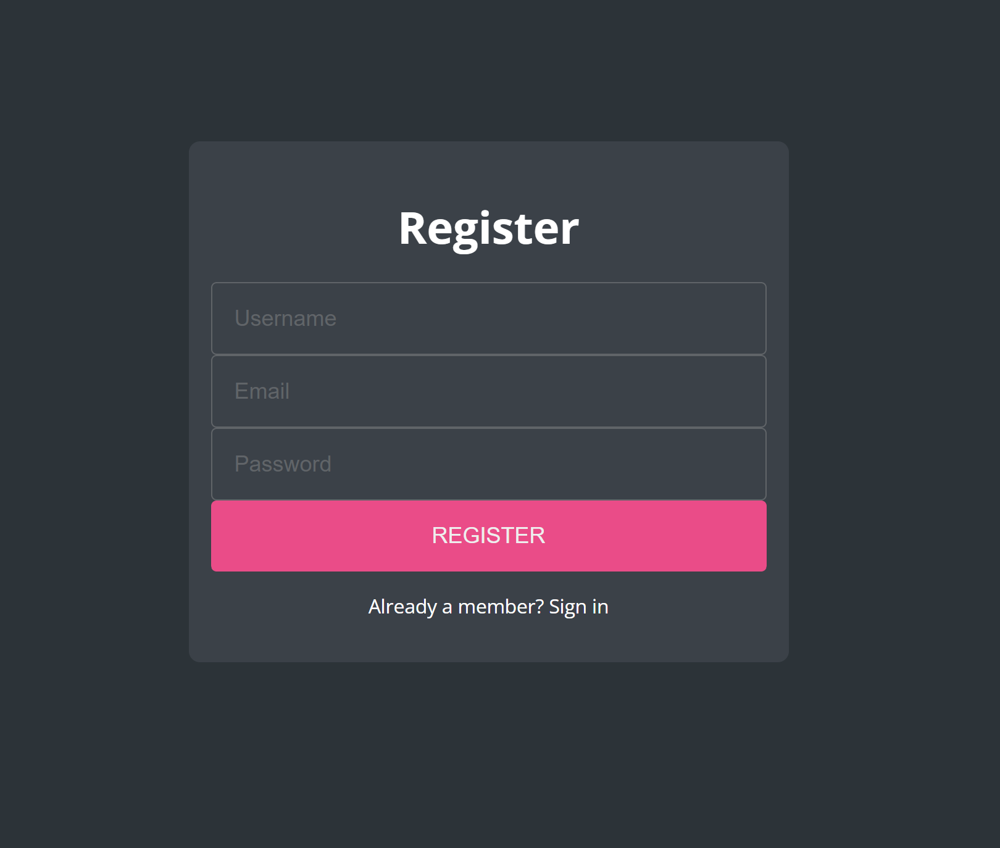
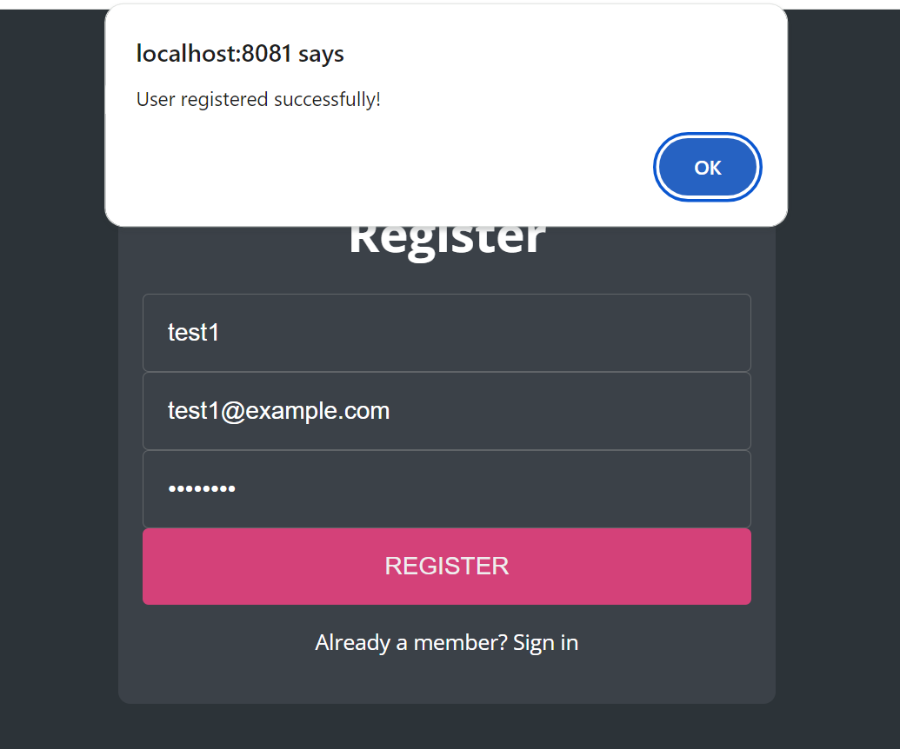
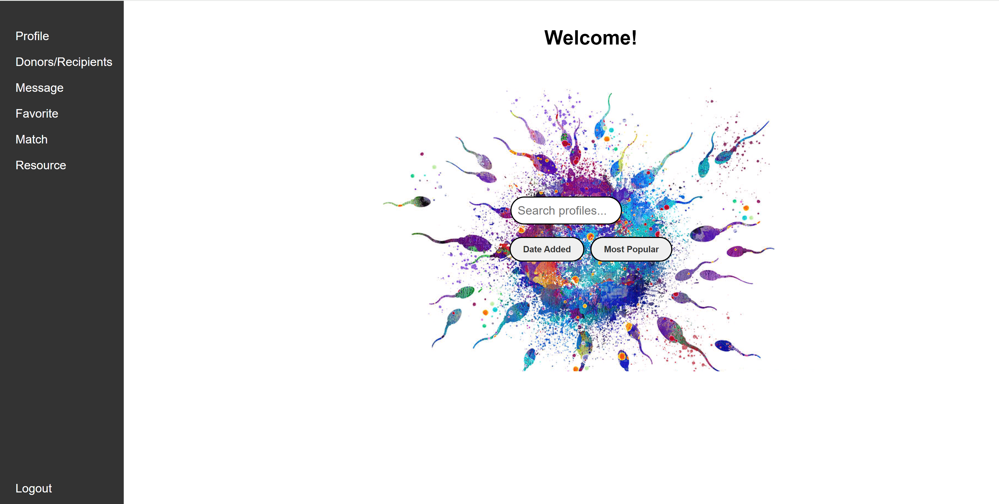

#  Hugbúnaðarverkefni 1 [HBV501G] - Team 27 - DonorMatch 
## Höfundar - Authors
Silja Rós Svansdóttir Þormar  
Þrándur Orri Ólason  
Guðrún Ísabella Kjartansdóttir  
Alexandra Björk Magnúsdóttir  
## Verkefni - Assignment
**DonorMatch**  
A website that connects individuals who seek sperm- or egg donors. User registers as a Donor (egg or sperm) or as a Recipient. Recipients can search for Donors via search bar and can favorite them. The donor can see recipients who have favorited them and can match with them. Matched donors and recipients can then message each other via Messages. If both parties are interested in booking a donation, they can do that via Bookings in the sidebar of their homepage. These bookings will be collected via Admin.
Each user type i.e. Donor, Recipient and Admin have different homepages and different tabs on the sidebar. 

## Structure and Run -  Uppsetning og keyrsla

This project is a web application that was built using Spring Boot, PostgreSQL, and Thymeleaf.

**Requirements**  

Before you begin, ensure you have the following installed:

Java 17  
Maven 3.9.4 or later  
PostgreSQL on Render  
pgAdmin 4 for database management  

**Clone the repository**  
git clone https://github.com/siljaros1994/Hugverk1.git  
cd hugverk1  

**Set up the database**  
Open pgAdmin4 and register the server from render.

**application.properties file**  
Update the application.properties file with your local PostgreSQL database by filling:

spring.datasource.url=jdbc:postgresql://localhost:5432/database  
spring.datasource.username=username  
spring.datasource.password=password  
spring.jpa.hibernate.ddl-auto=update

**Run the Application**  
Use Maven to build and run the application:  
mvn spring-boot:run  
Access the application locally at: http://localhost:8081

## Deploying web service on Render - keyra á vefnum með Render
Make sure the code is committed and pushed to a public or private GitHub repository.
in Render navigate to the web services section and click new web service, next connect your GitHub repository.
Make sure to use Dockerfile and configure the service.

**Deployment:**  
Once deployed, access the application at:
https://hugverk1.onrender.com

