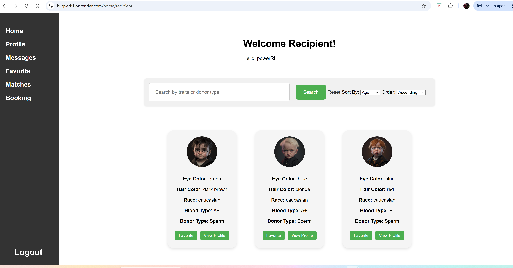

#  Hugbúnaðarverkefni 1 [HBV501G] - Team 27 - DonorMatch 
## Authors
Silja Rós Svansdóttir Þormar  
Þrándur Orri Ólason  
Guðrún Ísabella Kjartansdóttir  
Alexandra Björk Magnúsdóttir  
## Verkefnið
**DonorMatch**  
A website that connects individuals who seek sperm- or egg donors. User registers as a Donor (egg or sperm) or as a Recipient. Recipients can search for Donors via search bar and can favorite them. The donor can see recipients who have favorited them and can match with them. Matched donors and recipients can then message each other via Messages. If both parties are interested in booking a donation ...

## Structure and Run / Uppsetning og keyrsla
Run in pgAdmin 4 / keyrið pgAdmin 4
Go to terminal and write "mvn spring-boot:run" to run the program. / Farið í terminal og skrifið mvn spring-boot:run til að keyra.

